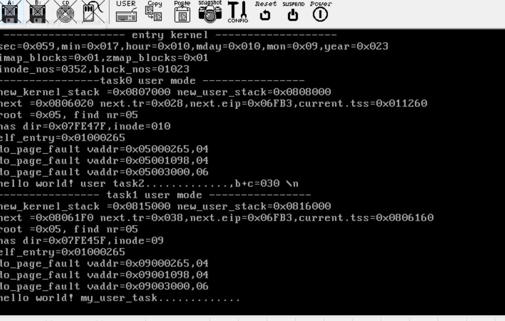

## 实现内容

### 1.进程
    进程切换
    进程调度，队列优先级调度
    fork/exit/execve 等接口实现
### 2.内存
    伙伴系统
    slab 分配
    页表
    页异常 | 页共享
### 3.文件
    Minix 文件模式
    读写文件
    超级快
    inode 表
### 4.设备驱动
    键盘驱动
    显示器驱动
### 5.中断跟全局表
    系统调用
    时钟中断
    硬盘中断
    键盘中断
    ....
#### 6.TCP/IP   实现中